# Grupo 1 - PC3

## Integrantes

-Jimenez Joel

-Vasquez Diego

-Hammer Franklin

-Berrospi Abraham


# Modulo 1
## Pregunta 1

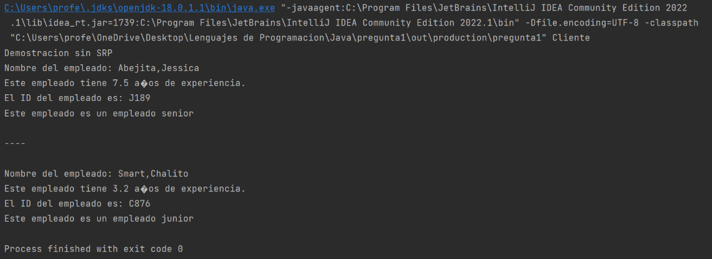

Demostracion sin SRP  
Nombre del empleado: Abejita,Jessica  
Este empleado tiene 7.5 años de experiencia.  
El ID del empleado es: J189  
Este empleado es un empleado senior  

----

Nombre del empleado: Smart,Chalito  
Este empleado tiene 3.2 años de experiencia.  
El ID del empleado es: C876  
Este empleado es un empleado junior  
  
Process finished with exit code 0  


Revisando el código podemos ver que en la clase cliente creamos dos instancias de tipo Empleado, además de que usaremos métodos de estos que explicaremos a continuación.  
El método CheckSeniority() de la clase Empleado revisar si la experiencia del empleado es mayor o no a 5, si es asi se considera un empleado "senior" pero si tiene menos de 5 años de experiencia lo clasificaremos como un empleado "junior".  
También vemos que el método generateEmpId() de la clase Empleado genera ID's de los empleados de la siguiente forma, primero toma la primera letra del nombre del empleado y luego lo une a un número random menor a mil.  

## Pregunta 2

Podemos ver que los metodos displayEmpDetail(), checkSeniority() y generateEmpId() están en una sola clase, lo cual hace que no cumpla la idea detrás del SRP (que cada clase, módulo o función en un programa debe tener una responsabilidad/propósito en un programa)
Es decir, la clase Empleado tienes tres responsabilidades, mostrar los detalles de un empleado, generar una identificación de empleado y revisar los años de experiencia del empleado. El código funcionará bien, pero dará lugar a algunos desafíos. No podemos hacer que este código sea reutilizable para otras clases u objetos.
La clase tiene mucha lógica interconectada en la cual nos costaría mucho corregir los errores, además de que a medida que crece el código, también lo hace la lógica, lo que hace que sea aún más difícil entender lo que está pasando.

## Pregunta 3

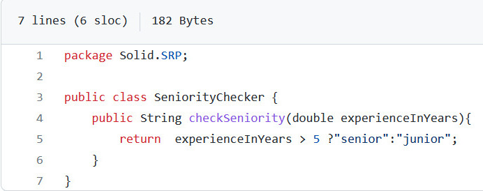

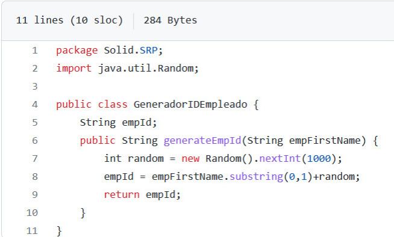

## Pregunta 4

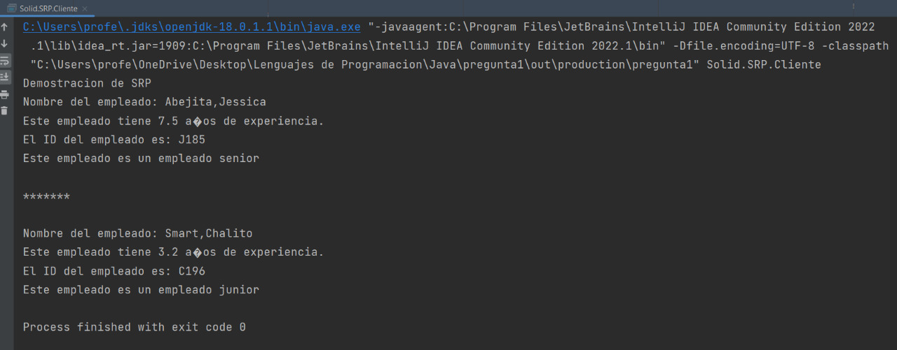

Demostracion de SRP  
Nombre del empleado: Abejita,Jessica  
Este empleado tiene 7.5 años de experiencia.  
El ID del empleado es: J185  
Este empleado es un empleado senior  

*******

Nombre del empleado: Smart,Chalito  
Este empleado tiene 3.2 años de experiencia.  
El ID del empleado es: C196  
Este empleado es un empleado junior  
  
Process finished with exit code 0  

Podemos ver que son imprime un formato parecido a cuando no aplicamos Single Responsibility Principle; sin embargo, como dijimos antes, ahora nos será mucho más fácil hacer cambios en el código, además de que la lógica es más fácil de entender.

# Modulo 2
## Pregunta 5

Como podemos observar en el enunciado, para el método displayResult() nos muestra los detalles necesarios para un estudiante (nombre, número de registro, calificaciones), sin embargo en la clase estudiante, podemos ver el método sobrescrito toString() el cual nos muestra detalles del estudiante, lo cual no sería óptimo, por lo tanto sería innecesario implementar dicho método en la clase estudiante.
Ahora para el método evaluateDistintion() observamos que en la clase DistintionDecider tenemos una lista de String para los departamentos( Ciencias de la Computación, Física, Historia, Ingles), ahora si se desearía añadir este método a la clase estudiante, se debería definir también estas listas, sin embargo hacer esta operación en cada llamado generaría la creación de un lista nueva. 


## Pregunta 6

Mostrando los resultados:

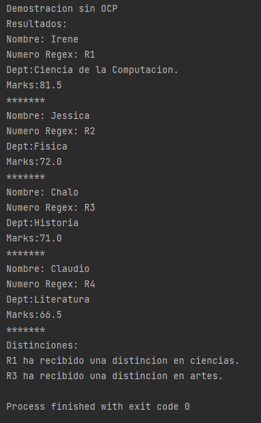

Explicando los pasos 

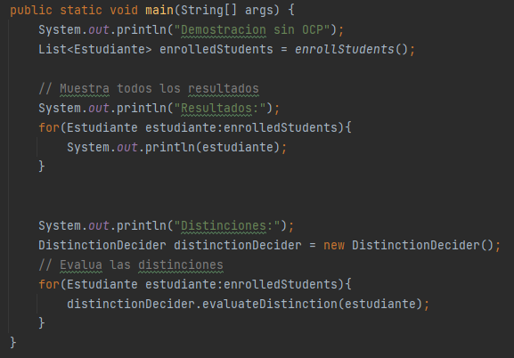

Podemos ver que en la clase cliente se crea una lista de tipo Estudiante que hace un llamado a la funcion enrollStudents() la cual crea y agrega objetos de tipo estudiante devolviendo una lista con los objetos añadidos.


## Pregunta 7

El principal problema que se tiene con este diseño es que cuando llamamos a la clase distintionDecider, el método que utiliza para verificar si se obtiene una distinción, generará 2 listas de los departamentos a los que pertenecen cada uno.
Esta acción genera inconvenientes si deseamos añadir algún departamento más, puesto que tendríamos que, realizar varias comprobaciones para cada una de ellas, como una posible solución sería generar una subclase de estudiante, en la cual ya se tenga el método que nos indique si el estudiante merece una distinción

## Pregunta 8
## Pregunta 9
## Pregunta 10
## Pregunta 11

# Modulo 3
## Pregunta 12: Muestra la salida y explica los resultados en función de los métodos entregados
Tenemos que la clase cliente dada como sigue
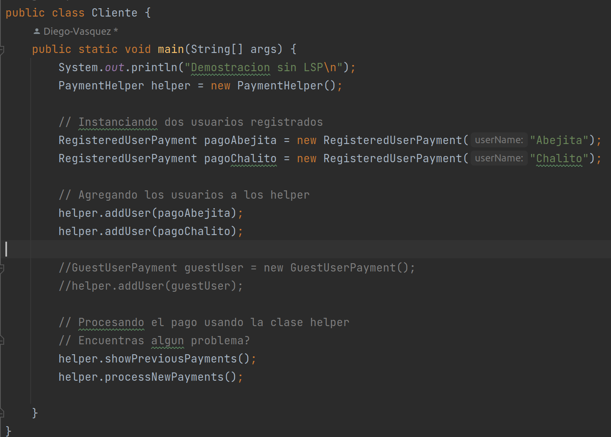
nos genera la siguiente salida
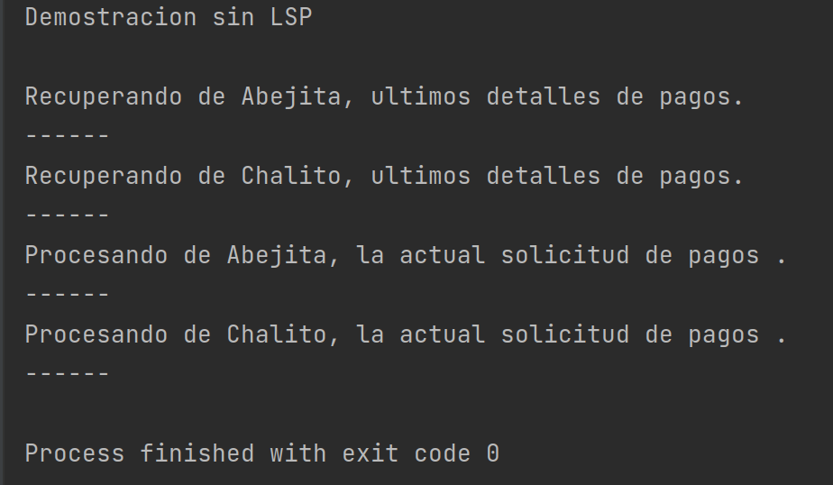
> De esta ejecución podemos ver que se instancia PaymentHelper, con el constructor por defecto que se hereda de Object,
> que para nuestro caso solo hara que su lista payments de la instancia se setee con una lista vacia.
> Ahora, luego de eso se instancian los dos registros de usuarios, Abejita y Chalito, donde se usa el constructor
> definido en su clase que en este caso solo recibe el nombre del usuario y lo setea en su variable de instancia name
> Luego, en la instancia helper, se agrega los dos usuarios creados con el método de instancia addUser del helper, este
> hara que se añada a la lista de Payments, recordando que tenemos que RegisterdUserPayment implementa esta interfaz,
> por lo que no tiene problema para funcionar.
> 
> Finalmente el helper ejecuta su metodo showPreviousPayments que iterara en su lista de Payments donde ejecutara para
> cada payment (para nuestro caso los usuarios) de su lista e irá mostrando su informacion previa con el método
> previousPaymentInfo propia de la interfaz payment que deben tener implementado, y en el caso del RegisterdUserPayment,
> aca muestra solo un mensaje sin mas.
> Luego el helper ejecuta processNewPayments que al igual que el método anterior itera sobre sus payments llamando a los
> métodos newPayment de cada uno, y que para la clase RegisterdUserPayment es un particular que contiene su nombre.

## Pregunta 13:
## Pregunta 14
## Pregunta 15
## Pregunta 16
## Pregunta 17
## Pregunta 18

# Modulo 4
## Pregunta 19
### Clases base vs interfaces:
Un tipo de interfaz es una descripción parcial de un valor, potencialmente compatible con muchos tipos de objetos. Utilice clases base en lugar de interfaces siempre que sea posible. Desde una perspectiva de control de versiones, las clases son más flexibles que las interfaces. Con una clase, puede enviar la versión 1.0 y luego en la versión 2.0 agregar un nuevo método a la clase. Mientras el método no sea abstracto, las clases derivadas existentes seguirán funcionando sin cambios.
Según el alcance de la estructura de código, se implementa unas algunas líneas dentro de cada una de las clases con el fin de imprimir el tipo de faz
```package NoSolid.ISP;


interface  Fax {
    void typeFax();
}
class LanFax implements Fax {
    public void typeFax() {
        System.out.println("Impresora de marca LanFax");
    }
}
class EFax implements Fax {
    public void typeFax() {
        System.out.println("impresora de marca EFax");
    }
}
```

## Pregunta 20
Dado que las interfaces no admiten la herencia de implementación, el patrón que se aplica a las clases no se aplica a las interfaces. Agregar un método a una interfaz equivale a agregar un método abstracto a una clase base; cualquier clase que implemente la interfaz se interrumpirá porque la clase no implementa el nuevo método.


Al realizar algún cambio a la clase  ImpresoraAvanzada este provocara que cambiemos el código de la interfaz Impresora, al realizar esto cambios esto afectara a la clase ImpresoraBasica.


## Pregunta 21
Se muestra las dos clases de impresoras:


Del algoritmo podemos notar que la implementación de las dos clases contienes dos métodos heredados de la interfaz Impresora, pero al considerar las diferentes características según la calidad y precio de las impresoras se diferencias en su funcionalidad.
En una impresora básica no se puede enviar fax como es en el caso de una impresora avanzada, por tanto el método sendFax de la clase ImpresoraBasica se envía una excepción. Lo que permite que el código cambie cada vez que se ejecute pero la función del código  no cambia en lo absoluto.
Una solución simple seria implementar una tercera interfaz con un método el cual esté especificado la característica que hace que sea diferente una de otro fax. Para que sea llamado cuando sea necesario, por decir cuando una impresora tenga la funcionalidad de enviar  se llama a la interfaz que contenga  ese método, y cuando no simplemente no se llama a esa interfaz


## Pregunta 22
```package NoSolid.ISP;

interface Impresora {
    void printDocument();

    void sendFax();

}
```

Como se menciona anteriormente implícitamente esta forma de código no es la última debido a que si se tiene objetos  con diferentes métodos que son atributo propio este se vea afectado al tener la necesidad de implementar un método el cual no tenga esta característica 
## Pregunta 23
Resultados de test:


Líneas de código

Como se mencionó en la pregunta 22 una de las formas más viables es implementar un segundo interfaz y separar  más el código  con el fin de evitar la necesidad de llamar un método que no tiene la impresora.


## Pregunta 24


Forma 2:
Se crea una lista de tipo impresora en cual guardara los métodos de cada una de la impresoras  y mediante una un recorro  la lista  e imprimo la función imprimir.


## Pregunta 25
En esta pregunta nos piden implementar una funcion lamdba:
Esto basicamente nos imprime los System.out.println de cada uno de los tipos de impresoras.


## Pregunta 26

Puede ver que para evitar las excepciones en tiempo de ejecución, necesitaba comentar una línea de código, comentar un código  no utilizado es algo que se busca evitar, porque cualquier cambio realizado en una clase este afecta a las demás clases.
Pero aparentemente el codigo esta bien desarrollado porque imprime lo que se tiene en cada uno de las caracteristicas de la impresora.


## Pregunta 27

La implementación de una interfaz más nos permite desarrollar una mejor gestión de los atributos de cada tipo de impresora.
La separación de   nos permite llamar la interfaz que necesitemos para darle ciertas características a cada impresora esto evita  tener que implementar un excepción o  comentar líneas de código que no son necesarias. Además que esto también nos permite tener mejor ordenado el código. Existe un método  que te permite delegar  e implementar el ISP, sin embargo esto hace que aumente el  tiempo de ejecución  de una aplicación, afectando el rendimiento.


## Pregunta 28

Cada vez que agrega un método en la clase base (o interfaz), el método debe implementarse (o estar disponible para su uso) en las clases derivadas. Este tipo de práctica puede violar OCP y LSP, lo que a su vez provoca problemas de mantenimiento y reutilización difíciles.

## Pregunta 29
Un método predeterminado de la interfaz se define de forma similar a la forma en que una clase define un método. La principal diferencia es que la declaración está precedida por la palabra clave default. Por ejemplo, considere esta interfaz simple
```
public interface MiInterfaz {
    //Esto es una declaración normal de un método
    //Esto no define la implementación de default
    int getUsuario();
    //Esto es un método default
    default int getAdmin(){
        return 1;
    }
}

```
Si una clase implementadora no proporciona su propia implementación, se utiliza el valor predeterminado
## Pregunta 30

Si des comentamos la siguiente línea y  comentamos la excepción en la clase básica nos daría como resultado.
```
package NoSolid.ISP;
class ImpresoraBasica implements Impresora {
    @Override
    public void printDocument() {
        System.out.println("La impresora imprime un documento.");
        System.out.println("===================");
    }
    @Override
    public void sendFax() {
        //throw new UnsupportedOperationException();
    }
}


```

```
class Cliente {
    public static void main(String[] args) {
        System.out.println("Demostracion sin ISP");
        Impresora impresora = new ImpresoraAvanzada();
        Fax fax_avanzada = new LanFax();
        impresora.printDocument();
        impresora.sendFax();
        fax_avanzada.typeFax();
        impresora = new ImpresoraBasica();
        Fax fax_basica = new EFax();
        impresora.printDocument();
        fax_basica.typeFax();
        impresora.sendFax();// Lanza un error
    }
}


```


 Si recordamos una excepción es un evento, que ocurre durante la ejecución de un programa, que interrumpe el flujo normal de las instrucciones del programa.
 
 
# Modulo 5
## Pregunta 31: Muestra la salida y explica los resultados en función de los métodos entregados
En el código que se nos indica tenemos los siguientes códigos, donde el cliente usa la interfaz de usuario y guarda un
dato.

Clase Cliente
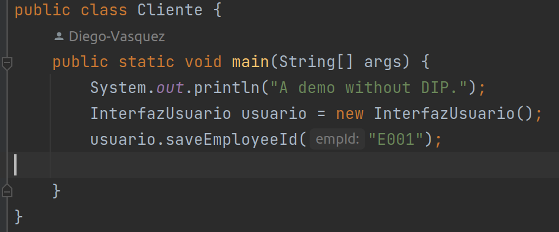
Clase OracleDatabase
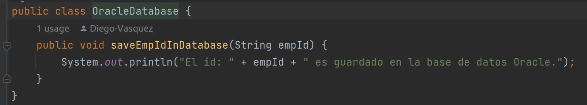
Clase InterfazUsuario
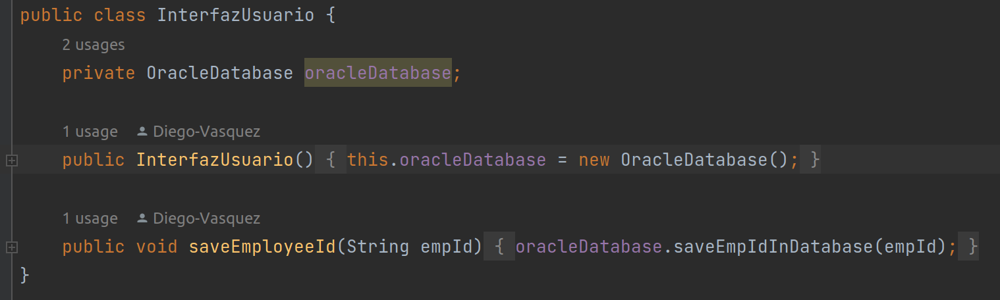
dando finalmente la siguiente salida
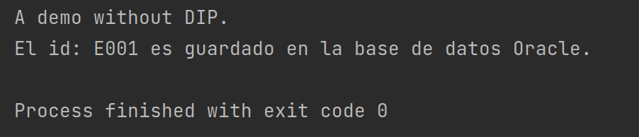

>Lo que ha hecho el código por el lado del cliente es que el cliente inicializa la interfaz de usuario
y solicita que se guarde una ID de un empleado. Ahora, internamente cuando se instanció la clase interfaz de usuario en
su constructor alberga la instrucción de inicializar una db, es por ello que cuando el cliente solicita guardar esta id
a través de la interfaz (usando el método SaveEmployeeID de la interfaz), dicha interfaz hace que la base de datos
inicie el proceso de guardado (es decir, el método de la interfaz a su vez llama al método SaveEmployeeInDatabase de 
la instancia de la bd), que para este caso solo hace una impresión de consola de la id que se le pasó.

## Pregunta 32: El programa es simple, pero ¿qué tipo de problemas presenta?
> Nosotros si nos fijamos en el código mostrado anteriormente, podemos ver rápidamente que la interfaz de usuario usa
> directamente a la clase OracleDataBase en vez de usar una abstracción de esta (una interfaz) por lo que esto hace que
> se establezca una dependencia de la clase de mayor nivel o jerarquia (InterfazUsuario), con respecto de la clase
> de menor jerarquia (OracleDatabase), esta dependencia fuerza que al momento de codificar tengamos ya una implementacion
> de OracleDatabase previa para probar el funcionanmiento de InterfazUsuario. También es evidente de que ante un cambio 
> que se de en la clase OracleDatabase (como el cambiar ciertas funcionalidades o el querer usar otra db) harían que
> también se vea afectada.
## Pregunta 33: Implementa la clase InterfazUsuario. La segunda parte del DIP sugiere hacer la interfaz de la base de datos considerando la necesidad de la clase InterfazUsuario.
Hemos realizado las siguientes implementaciones de la interface BaseDatos y la implementación OracleDatabase

Creacion de la interface BaseDatos, que solo captura la abstraccion de las db sin detalles
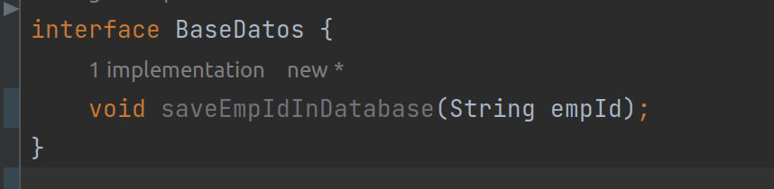
Implementación de OracleDatabase, donde se dan los detalles del método implementado, asi como los detalles propios
requeridos del mismo
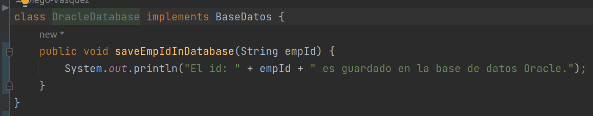
> Acá tenemos la implementación usando el principio SOLID de DIP, donde por un lado
> nosotros aca aseguramos con esta implementación que la clase interfaz usuario ahora ya no dependa
> de la clase OracleJava, sino que bajo la abstracción (primera parte del princio DIP) permite
> que esto sea mas flexible a los cambios, dado que ahora solo hace uso de la abstracción, la cual es
> implementada por la base Oracle y puede ser implementada por cualuier otra clase y podra tener mas garantias
> de que el software no se caerá tan facil, cuando la interfazUsuario utilice la interfaz.
>
> Por otro lado tenemos que también aplicamos la segunda parte de DIP, dado que hacemos que los detalles dependan de
> la abstracción, en este caso los detalles como de que sea publica se realiza dentro de la implementacion. Lo que en
> resumen esta nueva implementación es mucho mejor.

## Pregunta 34: Completa todos los archivos siguientes de la sección SOLID
Se hicieron las siguientes implementaciones

clase MySQLDataBase, se ha implementado usando la interface creada BaseDatos similar a la oracle
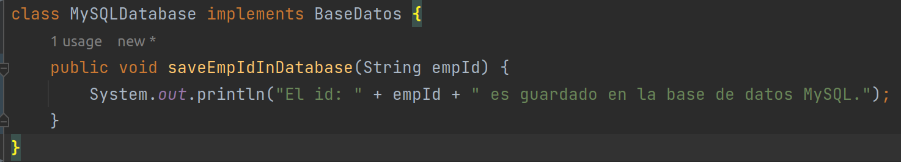
clase InterfazUsuario, se ha cambiado el tipo de dato de la variable database, ahora acepta a cualquier database
que implemente la interfaz DataBase
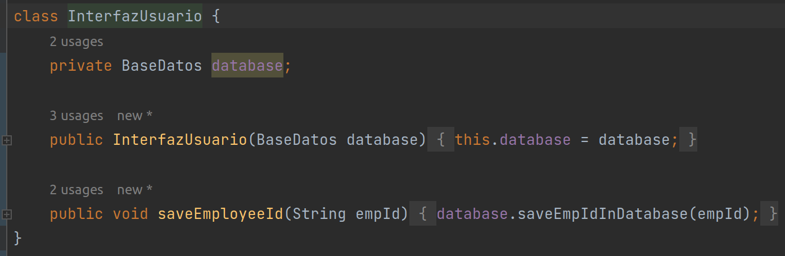
clase Cliente, muestra un código ejemplo para demostrar el funcionamiento exitoso del código.
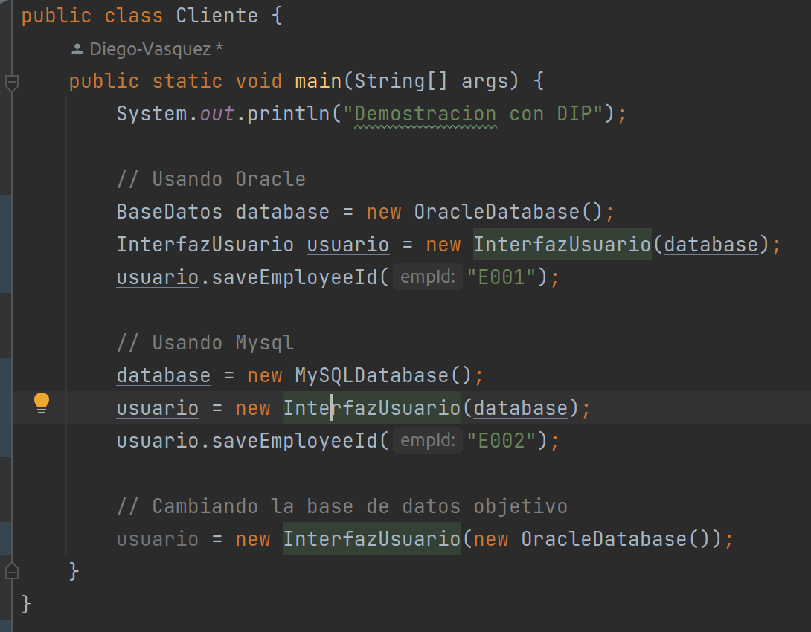

Explica los resultados.¿El programa resuelve todos los posibles problemas del programa que
no usa DIP?
> Como se vio en este caso, ahora hemos implementado la db en MySQL usando la interfaz dada, por lo que no tuvimos que
> modificar ni la interfaz, ni la db Oracle, por lo que vemos que ya se ha solucionado el problema de la dependencia de 
> InterfazUsuario con respecto a OracleDatabase, además se vio que facilmente la InterfazUsuario puede usar una u otra
> db sin problema alguno, lo que tambien muestra que otro de los problemas relacionados a implementacion se han 
> solucionado, además de haber disminuido el acoplamiento y que las pruebas no estan sujetas a si la db este implementada porque se usa una interfaz.
> En resumen, esto nos muestra que usando DIP pudimos solucionar los problemas que mencionamos anteriormente.

Ejecución exitosa de nuestro nuevo código usando DIP
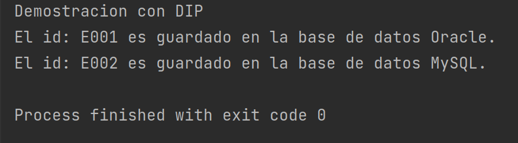

## Pregunta 35: Encuentra alguna excepción a esta sugerencia.
> Como vimos acá, la implementación da muchas facilidades, pero por ejemplo, si queremos que se pueda cambiar sin 
> necesidad de que tengamos que volver a instanciar por algun impedimente que podamos tener en el número de instancias,
> entonces tendríamos que implementar un método para poder setear la db cuando la interfaz ya esta instanciada y que nos
> permita cambiar la db en cualquier momento.
## Pregunta 36: El constructor de la clase InterfazUsuario acepta un parámetro de base de datos. Proporciona una instalación adicional a un usuario cuando utiliza tanto el constructor como el método setter (setDatabase) dentro de esta clase. ¿Cuál es el beneficio?.
Se han realizado las siguientes implementaciones

Se ha hecho publico el atributo database y se han creado sus métodos getter y setter
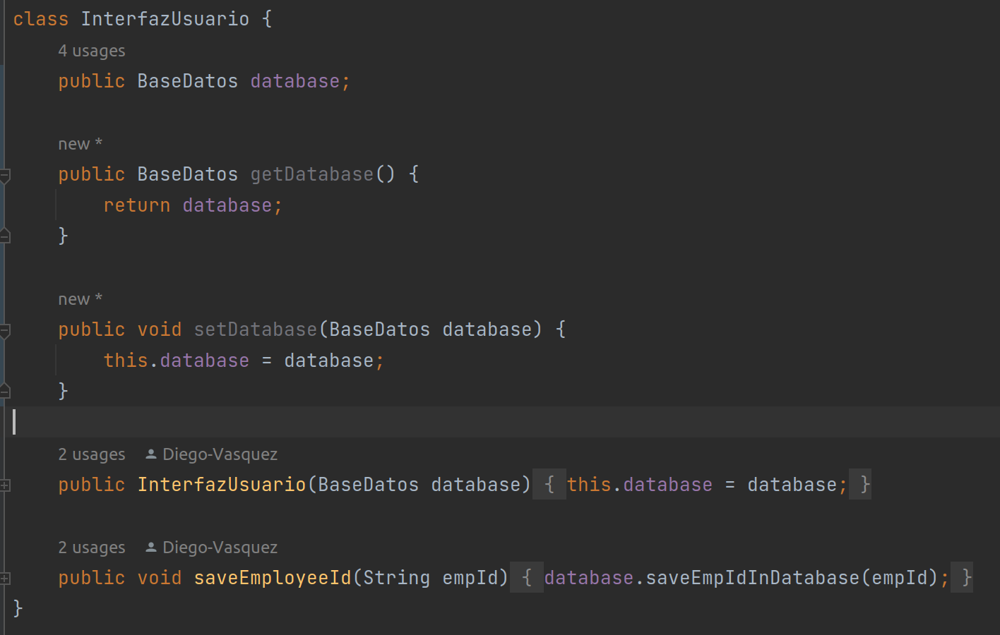
se ha colocado la linea de demostracion en el cliente
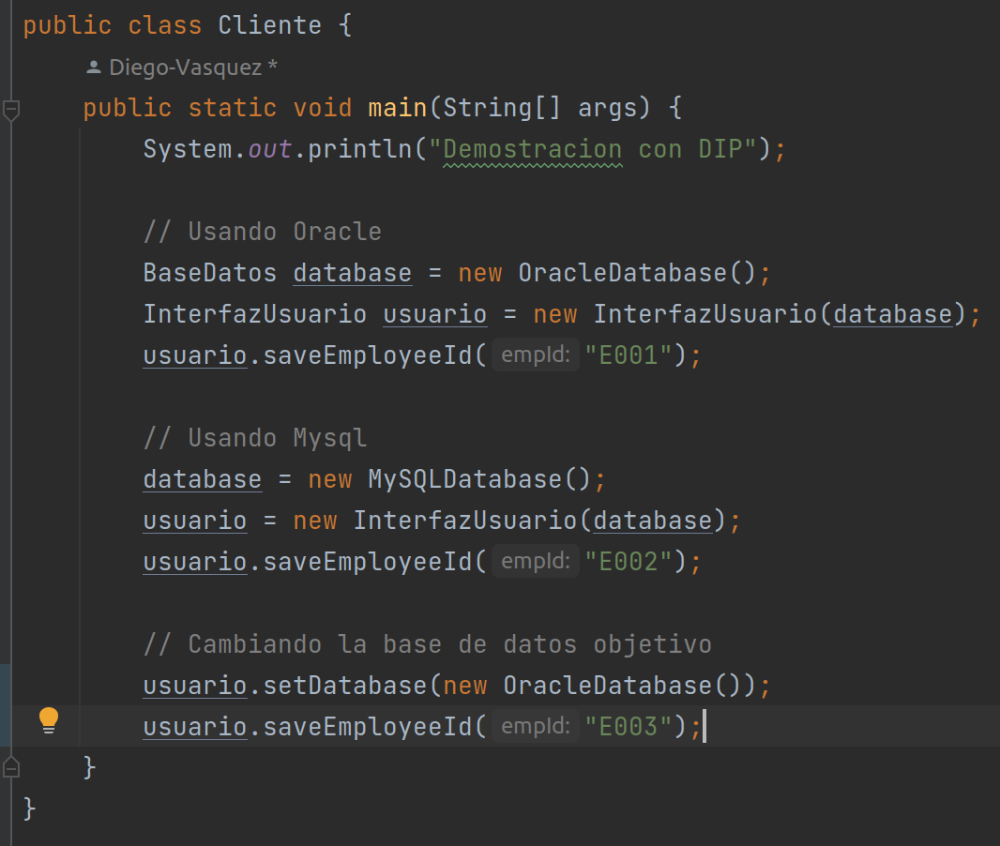

> Como se menciono, el beneficio es que podemos cambiar la db que la interfaz este usando sin tener que cambiar de
> instancia de interfaz de usuario. Por lo que que si tienes limitaciones en el número de instancias, con esto se
> solucionaria, o simplemente te permite cambiar en cualquier momento la db. Además de brindar otra alternativa de
> poder setear la db.

Ejecución del nuevo codigo de manera exitosa.
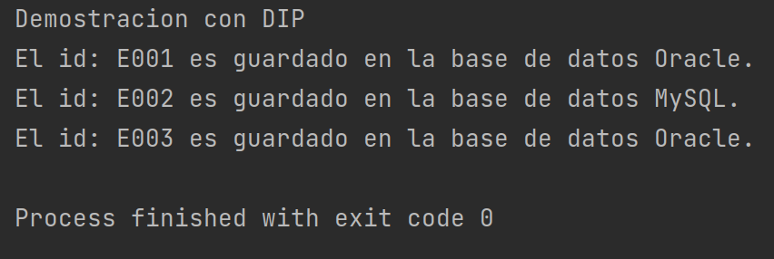
